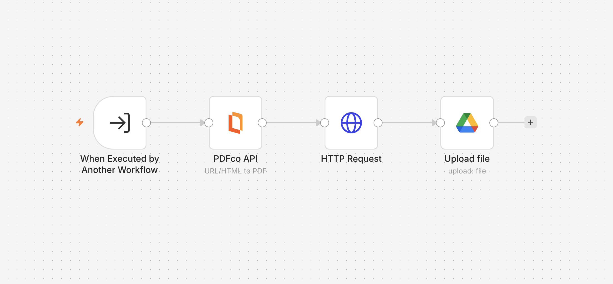

# 🤖 Ultimate AI Executive Assistant


An end-to-end, multi-tool **AI Agent** built with **n8n** that turns a single natural-language instruction into a chain of real business actions — research, document creation, PDF generation, file storage, email delivery, and conflict-aware meeting scheduling — with zero manual steps in between.

---

## 📋 Table of Contents

- [Overview](#-overview)
- [Demo](#-demo)
- [Business Problem](#-business-problem)
- [Features](#-features)
- [System Flow](#-system-flow)
- [Architecture](#-architecture)
- [Project Architecture](#-project-architecture)
- [Workflow Example](#-workflow-example)
- [Technical Stack](#-technical-stack)
- [Challenges & Debugging](#-challenges--debugging)
- [Key Learnings](#-key-learnings)
- [Author](#-author)

---

## 🧠 Overview

**Ultimate AI Executive Assistant** is a multi-tool AI Agent built in n8n that behaves less like a chatbot and more like a real assistant — one that can take a single, open-ended instruction and autonomously decide which tools to use, in what order, to get the job done.

Instead of answering a question, it *acts*: it researches a topic, drafts a report, converts it to a polished PDF, saves it to cloud storage, emails it to the right person, and checks a real calendar for conflicts before booking a meeting — all from one sentence typed into a chat window.

**Built with:**
- 🧠 Google Gemini (reasoning engine)
- 📧 Gmail (email delivery)
- 📅 Google Calendar (event creation + availability checking)
- 📁 Google Drive (file storage)
- 📄 Google Docs (report generation)
- 🔎 Tavily AI (real-time web research)
- 🧾 PDF.co API (PDF generation)
- ⚙️ n8n (orchestration engine)

---

## 🎥 Demo

**Watch the assistant complete a full multi-step task in one instruction:**

▶️ **[View the Loom Demo](https://www.loom.com/share/013391bdce5f4e6094b7b998e2b88f3d)**

> In the demo, a single chat message triggers research, report generation, PDF conversion, Drive upload, email delivery, calendar conflict checking, and meeting booking — executed autonomously, in order, by the AI Agent.

---

## 🎯 Business Problem

Founders, solo operators, and busy professionals lose hours every week to small, repetitive coordination work: researching a topic, writing it up, saving the file somewhere sensible, emailing it to a colleague, and then separately checking their calendar before booking a meeting.

Each of these tasks is simple on its own — but done manually, in sequence, several times a day, it adds up to real lost time. Most "AI assistant" tools only handle one link in that chain (a chatbot that answers questions, or a scheduler that only schedules). This project closes that gap: **one instruction, one agent, the whole chain handled automatically** — including the safety check that most simple automations skip: verifying a time slot is actually free before committing to it.

---

## ⚡ Features

| Feature | Status |
|---|---|
| AI-powered web research (Tavily) | ✅ |
| Google Docs report generation | ✅ |
| PDF generation from generated content | ✅ |
| Automatic Google Drive upload | ✅ |
| Gmail integration for sending reports | ✅ |
| Google Calendar event creation | ✅ |
| Calendar conflict detection before booking | ✅ |
| Persistent conversation memory | ✅ |
| Multi-step, chained instruction handling | ✅ |
| Full tool orchestration by a single AI Agent | ✅ |

---

## 🔀 System Flow

```
                          👤 USER
                            │
                 "Research X, make a report,
                  email it, book a meeting"
                            │
                            ▼
                    ┌───────────────┐
                    │   AI AGENT    │  ← Google Gemini + Memory
                    │ (orchestrator)│
                    └───────┬───────┘
                            │
            decides which tools to call, in what order
                            │
                            ▼
                  🔎 AI RESEARCH (Tavily)
                            │
                            ▼
                  📄 GOOGLE DOCS REPORT
                            │
                            ▼
                  🧾 PDF GENERATION (PDF.co)
                            │
                            ▼
                  📁 GOOGLE DRIVE UPLOAD
                            │
                            ▼
                  📧 GMAIL DELIVERY
                            │
                            ▼
                  📅 CALENDAR CONFLICT CHECK
                            │
                   ┌────────┴────────┐
                   │                 │
              slot is FREE      slot is BUSY
                   │                 │
                   ▼                 ▼
        📅 CREATE MEETING    ⚠️ REPORT CONFLICT
                   │            (no booking made)
                   └────────┬────────┘
                            │
                            ▼
                  ✅ SUMMARY BACK TO USER
```

---

## 🏗️ Architecture

### Main Workflow

The central orchestrator: a chat trigger feeds into an **AI Agent** (powered by Google Gemini with persistent Simple Memory). The Agent has seven tools available to it — Gmail, Google Calendar, Google Drive, PDF Generator, Google Docs Report, AI Research, and Schedule Meeting — and decides at runtime which ones to call, and in what order, based on the user's request.

### Meeting Workflow

A dedicated sub-workflow responsible for actually creating a calendar event once a slot has been confirmed as free. It receives structured input (date, time, title, description) from the AI Agent and books the event directly on Google Calendar.

### Schedule Meeting (Conflict Checker) Workflow

The safety layer of the whole system. Before any meeting is booked, this sub-workflow queries Google Calendar for the requested time window, determines whether a real conflicting event exists, and returns a clear `success: true/false` response with a human-readable message — so the AI Agent always knows whether it's safe to book before it does.

### Google Docs Workflow

Creates a new Google Doc, has Gemini write the report content into it based on the research findings, and updates the document — turning raw research into a properly formatted, saved report.

### PDF Generator Workflow

Takes the generated report content, converts it into a polished PDF via the PDF.co API, and uploads the resulting file to Google Drive — making the report portable and shareable.

---

## 🧩 Project Architecture

At the center of this project is a single **AI Agent** acting as the orchestrator. Rather than following a fixed, linear pipeline, the Agent reasons over the user's request and decides — dynamically, per conversation — which of its seven tools to invoke, in what sequence, and with what parameters.

### The Seven Tools

1. **Gmail** — sends emails on the user's behalf (reports, confirmations, follow-ups)
2. **Google Calendar** — creates calendar events once a slot is confirmed free
3. **Google Drive** — stores generated files (documents, PDFs) in the cloud
4. **Google Docs Generator** — creates and writes AI-generated report content into a live document
5. **PDF Generator** — converts report content into a shareable PDF via the PDF.co API
6. **AI Research (Tavily)** — performs real-time web research on any topic, company, or current event
7. **Schedule Meeting (Calendar Conflict Checker)** — the safeguard tool; checks calendar availability *before* any booking is confirmed, preventing double-bookings

Each tool is implemented as its own n8n sub-workflow, called via n8n's "Execute Workflow" tool-calling mechanism. This keeps every tool independently testable, debuggable, and reusable — the Agent doesn't need to know *how* a tool works internally, only *what* it returns.

---

## 🔄 Workflow Example

**User input:**
> "Research the latest AI trends, create a report, convert it into PDF, upload it to Drive, email it to me, and schedule a meeting tomorrow at 3 PM."

**What the Agent actually does, step by step:**

1. **Research** — Calls the AI Research tool, which queries Tavily for current information on the latest AI trends and returns a structured summary of findings.
2. **Report Generation** — Calls the Google Docs tool, creating a new document and using Gemini to write up the research findings into a coherent, readable report.
3. **PDF Conversion** — Calls the PDF Generator tool, converting the report content into a polished PDF via the PDF.co API.
4. **Drive Upload** — The generated PDF is automatically uploaded to Google Drive as part of the PDF Generator sub-workflow.
5. **Email Delivery** — Calls the Gmail tool to send the report (and/or a link to the saved file) to the specified recipient.
6. **Availability Check** — Before booking anything, calls the Schedule Meeting tool to check whether tomorrow at 3 PM is actually free on the calendar.
7. **Conditional Booking** — If the slot is free (`success: true`), it calls the Meeting tool to create the calendar event. If the slot is occupied (`success: false`), it reports the conflict back to the user instead of booking, and asks whether to pick a different time.
8. **Final Summary** — The Agent replies with a clear, human-readable summary of every action taken — what succeeded, and what (if anything) requires the user's attention.

No manual steps. One instruction in, a fully executed multi-step business outcome out.

---

## 🛠️ Technical Stack

| Layer | Technology | Role in the System |
|---|---|---|
| Orchestration | n8n | Workflow engine, node execution, credential management |
| AI Agent Framework | n8n AI Agent node | Tool-calling architecture and reasoning loop |
| LLM | Google Gemini | Powers reasoning, report writing, and response generation |
| Memory | n8n Simple Memory | Maintains conversational context across turns |
| Email | Gmail API | Sends reports and confirmations |
| Calendar | Google Calendar API | Creates events and checks availability |
| File Storage | Google Drive API | Stores generated documents and PDFs |
| Document Generation | Google Docs API | Builds and writes AI-generated reports |
| PDF Generation | PDF.co API | Converts report content into shareable PDFs |
| Web Research | Tavily API | Real-time research and current information retrieval |

---

## 🐞 Challenges & Debugging

Building a reliable multi-tool agent surfaced several non-obvious n8n and prompt-engineering issues along the way:

**1. Silent workflow termination on empty results**
The Google Calendar "Get many events" node would halt the entire sub-workflow whenever a queried time slot had zero existing events — n8n stops execution by default when a node returns no output data. This meant the availability checker silently failed exactly when a slot was free. **Fix:** enabled "Always Output Data" on the node so it reliably passes through even an empty result.

**2. Conditional logic checking the wrong value**
After fixing issue #1, a Code node was introduced to always emit exactly one item. This inadvertently broke a downstream IF node that had been checking the number of items rather than the actual conflict flag — meaning the branch decision no longer reflected the real calendar state. **Fix:** updated the IF condition to evaluate the explicit `hasConflict` boolean produced by the Code node, rather than counting items.

**3. Timezone mismatch causing missed conflicts**
Calendar queries were built using date/time strings with no explicit timezone offset, which meant Google's API was interpreting them in UTC rather than the local IST timezone — causing the system to search the wrong window entirely and miss real conflicts. **Fix:** explicitly appended the `+05:30` offset to all datetime expressions sent to the Calendar API.

**4. AI Agent hallucinating dates**
The Agent's system prompt included a `{{ $now }}` expression intended to inject the real current date — but the field was set to "Fixed" mode rather than "Expression" mode, so the expression was never evaluated and sat as literal text. The Agent, with no real date to anchor to, invented plausible-but-wrong dates on different runs. **Fix:** switched the system message field to Expression mode, allowing the live date/time to be correctly injected on every run.

**5. Multi-step instructions being shortcut**
Given a chained instruction with several distinct actions, the Agent would sometimes only complete the final step (e.g., booking a meeting) while skipping the earlier ones (research, PDF, email) — a common failure mode where AI agents "satisfice" rather than exhaustively complete a checklist. **Fix:** added an explicit rule to the system prompt requiring every step of a multi-part request to be completed in order, with no skipping ahead.

---

## 🎓 Key Learnings

- **Tool orchestration is a fundamentally different design problem than pipeline automation** — the Agent must be trusted to make sequencing decisions, not just execute a fixed chain of nodes.
- **n8n's execution model has sharp edges around empty outputs** — a node that legitimately has "nothing to return" can silently kill an entire workflow unless explicitly configured otherwise.
- **Prompt engineering extends to expression evaluation, not just wording** — an unevaluated `{{ }}` expression is functionally invisible to the model, and this class of bug is easy to miss since the prompt *looks* correct.
- **Safety checks need to be structurally enforced, not just suggested** — explicitly requiring the Agent to check availability *before* booking, as a hard rule rather than a soft preference, is what actually prevents double-bookings in practice.
- **Debugging an AI Agent means debugging both the workflow logic and the model's interpretation of it** — several of the hardest bugs here weren't in the n8n nodes at all, but in how reliably the Agent's prompt translated into the correct tool calls.

---

## 👤 Author

**Mayank Gupta** — AI Automation Engineer specializing in n8n workflows, AI agents, and business process automation.

Open to freelance automation projects and collaboration.

---

*If this project is useful to you, a ⭐ is appreciated.*
